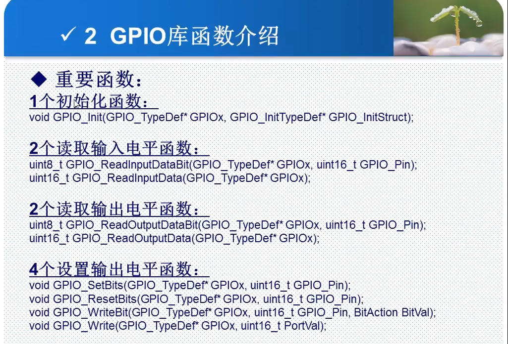

---
title: STM32学习笔记
date: 2021-07-29
collapsable: true
lineNumbers: false
cover: /img/slm.jpg
tags:
 - STM32
 - 单片机
categories: 
 - 学习
---  

:::tip
初学STM32  
相对于51单片机而言，STM32的学习会复杂许多，也比较难  
但功能强大，能适应很多场景  
:::

<!-- more -->

# 前言  

# STM32命名解释  
## 产品系列  
STM32 = 基于ARM的32位微控制器  
## 产品类型  
F = 通用类型  
## 产品子系列  
101 = 基本型  
102 = USB型，USB2.0全速设备  
103 = 增强型  
105或107 = 互联型  
## 引脚数目  
T = 36脚  
C = 48脚  
R = 64脚  
V = 100脚  
Z = 144脚  
B = 208脚  
N = 216脚  
## 闪存存储器容量（FLASH）  
4 = 16K字节的闪存存储器  
6 = 32K字节的闪存存储器  
8 = 64K字节的闪存存储器  
B = 128K字节的闪存存储器  
C = 256K字节的闪存存储器  
D = 384K字节的闪存存储器  
E = 512K字节的闪存存储器  
I = 2048K字节的闪存存储器  
## 封装  
H = BGA  
T = LQFP  
U = VFQFPN  
Y = WLCSP64  
## 温度范围  
6 = 工业级温度范围， -40°C~85°C  
7 = 工业级温度范围， -40°C~105°C  
## 内部代码  
A 或者空 (详见产品数据手册)  
## 选项
xxx = 已编程的器件代号(3个数字)  
TR = 卷带式包装  

# 文件目录结构  

```
基于固件库: (以“STM32F4xx标准例程”为准)

project(跟目录)
    |--CORE(核心与启动文件)
    .    |-core_cm4.h
    .    |-core_cm4_simd.h
    .    |-startup_stm32f40_41xxx.s
    |--FWLIB(官方库函数源码)
    .    |--inc
    .    .   |-misc.h
    .    .   |-stm32f4xx_adc.h
    .    .   |-....
    .    |--src
    .    .   |-misc.c
    .    .   |-stm32f4xx_adc.c
    .    .   |-....
    |--OBJ(编译文件以及hex文件)
    .    |-xxx.crf
    .    |-xxx.d
    .    |-xxx.o
    .    |-xxx.lst
    .    |-xxx.hex
    |--SYSTEM(通用文件)
    .    |--delay
    .    .   |-delay.c
    .    .   |-delay.h
    .    |--sys
    .    .   |-sys.c
    .    .   |-sys.h
    .    |--usart
    .    .   |-usart.c
    .    .   |-usart.h
    |--USER(工程代码)
    .    |-main.c
    .    |-xxx.uvproj
    .    |-....
    |-keilkill.bat
    |-readme.txt
```  
:::warning
启动文件需要区分大小  
ld.s小容量（FLASH<=32K）  
md.s中等容量(64K<=FLASH<=128K)  
hd.s大容量(256K<=FLASH)  
:::  

```
基于寄存器：
project
    |--CORE(核心文件)
    .   |-core_cmx.h
    .   |-core_cmx_simd.h
    .   |-startup_stm32fxxx_xxx.s
    |--FWLIB(启动文件)
    .   |--inc
    .   .   |-xxx.h
    .   .   |-....
    .   |--src
    .   .   |-xxx.c
    .   .   |-....
    |--(ProjectName)(工程文件)
    .   |--xxxx
    .   |--....
    |--OBJ(链接文件夹)
    .   |-xxx.o
    .   |-xxx.d
    .   |-xxx.crf
    .   |-....
    |--SYSTEM(通用文件夹)
    .   |--delay
    .   .   |-delay.c
    .   .   |-delay.h
    .   |--sys
    .   .   |-sys.c
    .   .   |-sys.h
    .   |--usart
    .   .   |-usart.c
    .   .   |-usart.h
    |--USER(用户自定义文件夹)
    .   |-xxx.uvproj
    .   |-main.c
    .   |-xxx.c
    .   |-xxx.h
    .   |-....
    |-keilkill.bat
    |-readme.txt
```  

# STM32工作模式  
## 输入模式  
### 输入浮空  
### 输入上拉  
### 输入下拉  
### 模拟输入  

## 输出模式  
### 开漏输出  
### 开漏复用功能  
### 推挽式输出  
### 推挽式复用功能  

## 3种最大翻转速度  
- 2MHz  
- 10MHz   
- 50MHz  

# 库函数  
## GPIO库函数介绍  
  
|--FWLIB文件夹下需要包含以下文件  
....|-misc.c  
....|-stm32fxxx_gpio.c  
....|-stm32fxxx_rcc.c  
....|-stm32fxxx_usart.c(可选)  
....|-stm32fxxx_dbgmcu.c(可选)  

### GPIO初始化函数  
```c
void GPIO_Init(GPIO_TypeDef*GPIOx, GPIO_InitTypeDef*GPIO_InitStruct);
```  
作用： 初始化一个或多个IO口（同一组）的工作方式和速度。

GPOIx: GPIOA~GPIOG  
```c
typedef struct
{
    uint16_t GPIO_Pin;              //指定要初始化的IO口  
    GPIOSpeed_TypeDef GPIO_Speed;   //设置IO口输出速度  
    GPIOMode_TypeDef GPIO_Mode;     //设置工作模式：8种中的一个
}GPIO_InitTypeDef;
```  
:::warning
注意  
外设（包括GPIO）在使用之前，几乎都要先使用对应的时钟。
:::
