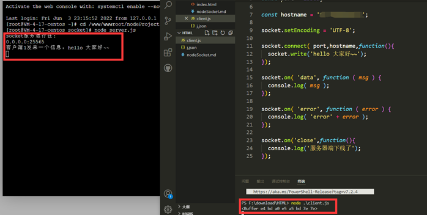

# nodejs使用socket简单通信
参考：[https://blog.csdn.net/qq_43659504/article/details/90314932](https://blog.csdn.net/qq_43659504/article/details/90314932)
## 前置环境
首先我们得需要[nodejs](nodejs.org)  
一点点的nodejs编程基础

## 服务端
创建一个文件`server.js`  
内容如下  
```js
const net = require( 'net' );
const port = 8000;
const hostname = '127.0.0.1';

// 定义两个变量， 一个用来计数，一个用来保存客户端
let clients = {};
let clientName = 0;

// 创建服务
const server = new net.createServer();

server.on('connection', (client) => {
  client.name = ++clientName;           // 给每一个client起个名
  clients[client.name] = client;        // 将client保存在clients

  client.on('data', function (msg) {
    // 接收client发来的信息
    console.log(`客户端${client.name}发来一个信息：${msg}`);
    // 给客户端反馈一条消息
    client.write('你好~~');
  });

  client.on('error', function (e) {
    // 监听客户端异常
    console.log('client error' + e);
    client.end();
  });

  client.on( 'close', function () {
    delete clients[client.name];
    console.log(`客户端${ client.name }下线了`);
  });
});

server.listen( port,hostname,function () {
  console.log(`socket服务运行在:\n${hostname}:${port}`);
});
```  
保存，然后再该文件目录下输入以下命令  
```sh
node server.js
```  

运行后提示
```sh
socket服务运行在:
127.0.0.1:8000
```

## 客户端
创建一个文件`client.js`  
其内容如下  
```js
const net = require('net');

const socket = new net.Socket();

const port = 8000;

const hostname = '127.0.0.1';

socket.setEncoding = 'UTF-8';

socket.connect( port,hostname,function(){
  socket.write('hello 大家好~~');
});

socket.on( 'data', function ( msg ) {
  console.log( msg );
});

socket.on( 'error', function ( error ) {
  console.log( 'error' + error );
});

socket.on('close',function(){
  console.log('服务器端下线了');
});
```  
保存，然后再该文件目录下输入以下命令  
```sh
node client.js
```
运行后输出：
```sh
<Buffer e4 bd a0 e5 a5 bd 7e 7e>
```
效果图  


:::warning
服务端  
如果是本地服务器，推荐127.0.0.1作为映射ip  
如果是云服务器，推荐0.0.0.0作为映射ip
:::

