:::tip
PID控制算法的使用非常广泛！ 
是电路控制中必学的算法。
:::
<!-- more -->
# PID算法学习笔记

# 引入
&emsp;&emsp;PID控制算法是结合比例、积分和微分三种环节于一体的控制算法，它是连续系统中技术最为成熟、应用最为广泛的一种控制算法，该控制算法出现于20世纪30至40年代，适用于对被控对象模型了解不清楚的场合。 
&emsp;&emsp;实际运行的经验和理论的分析都表明，运用这种控制规律对许多工业过程进行控制时，都能得到比较满意的效果。PID控制 的实质就是根据输入的偏差值，按照比例、积分、微分的函数关系进行运算，运算结果用以控制输出。

## 适用系统
满足线性高斯系统 
线性高斯性：
- 1、齐次性: ky=f(kx)
- 2、叠加性: y1+y2=f(x1)+f(x2)=f(x1+x2)
- 高斯性：噪声满足正太分布
 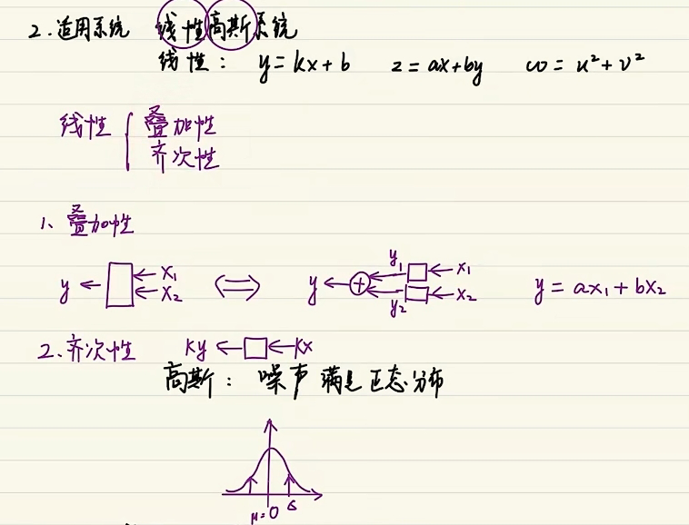
### 细化适用系统
准确地来说是适用二阶以内的线性系统(数学表达如图) 
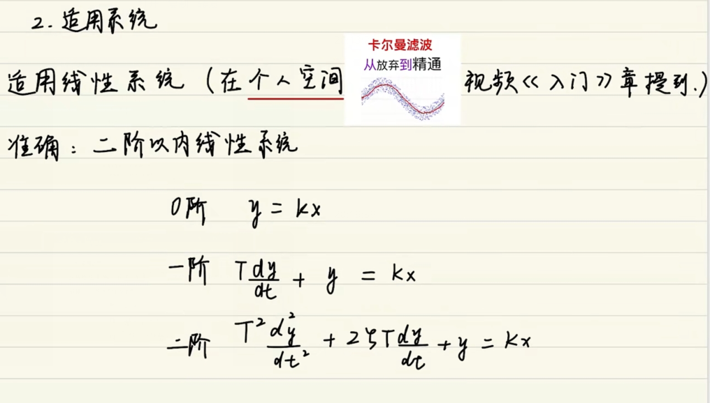
[卡尔曼滤波视频链接](https://www.bilibili.com/video/BV1Rh41117MT)
- 一阶系统举例 
&emsp;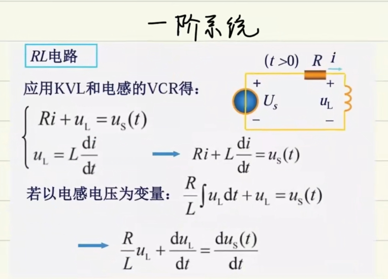
- 二阶系统举例 
&emsp;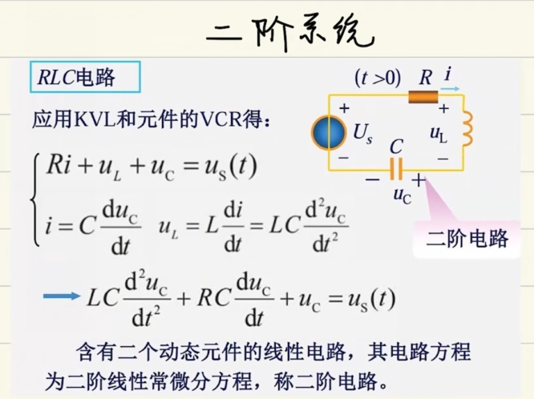
:::tip
- 高阶系统若可以简化为二阶系统有可能适用PID算法
- 非线性系统通过[李雅普诺夫定理](https://zhuanlan.zhihu.com/p/58738073)在非线性系统平衡点处线性化也可能适用PID算法。
:::

## 原理
[来自百度百科-PID算法](https://baike.baidu.com/item/PID%E7%AE%97%E6%B3%95/)
### PID控制原理
闭环控制是根据控制对象输出反馈来进行校正的控制方式，它是在测量出实际与计划发生偏差时，按定额或标准来进行纠正的。比如控制一个电机的转速，就得有一个测量转速的传感器，并将结果反馈到控制路线上。提到闭环控制算法，不得不提PID，它是闭环控制算法中最简单的一种。PID是比例 (Proportion) 积分 ,(Integral) 微分 ,(Differential coefficient) 的缩写，分别代表了三种控制算法。通过这三个算法的组合可有效地纠正被控制对象的偏差，从而使其达到一个稳定的状态。

### PID参数调节
在整定PID控制器参数时，可以根据控制器的参数与系统动态性能和稳态性能之间的定性关系，用实验的方法来调节控制器的参数。有经验的调试人员一般可以较快地得到较为满意的调试结果。在调试中最重要的问题是在系统性能不能令人满意时，知道应该调节哪一个参数，该参数应该增大还是减小。

## 开环控制系统
### 一般开环控制系统框图
如：水流量控制开关 
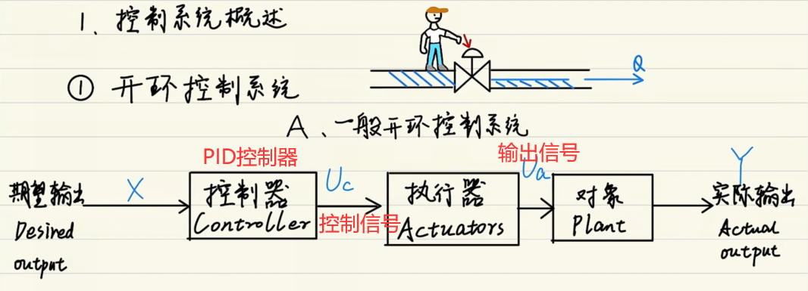 
缺点：
无反馈，导致无法自动调节。

### 前馈控制系统框图
如：水流量控制开关 
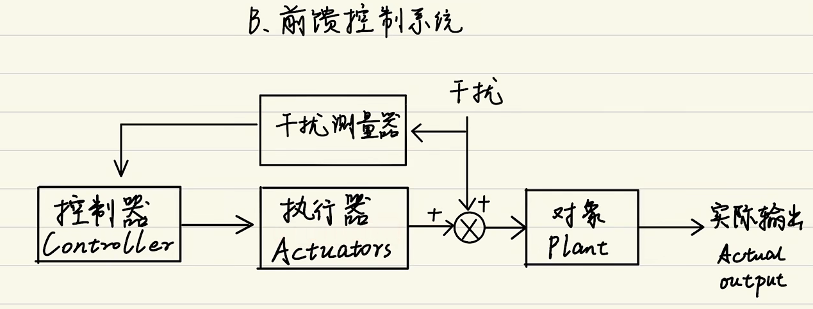 
若不存在干扰则直接作用于对象。若有干扰则检测干扰，利用控制器计算出`补偿`然后输出给执行器再作用到对象。

## 闭环控制系统
### 单闭环
如：水流量控制开关 
系统框图 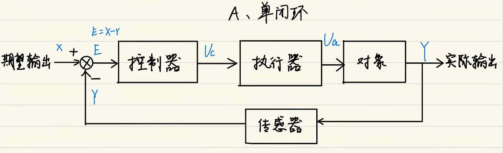 
与一般开环系统多一个反馈。

### 双闭环
如：水位控制开关
 系统框图 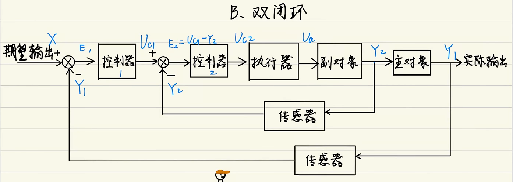
 与一般单闭环控制系统多一个闭环，外层的环叫外环，内层叫内环。
 传感器是人的眼睛，观察反馈信息，控制器1为人脑，根据水位变化做出计算。
 控制器2也为人脑，用于做其他任务（运算）。
 执行器是水阀，直接控制副对象（管道），进而影响水箱（主对象）。

**控制过程** 
以下图为例 
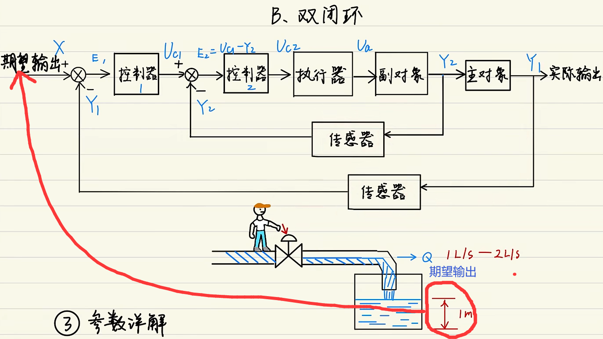
 水位1m为我们的期望输出，与我们实际输出作差后得到E1，利用E1输入控制器控制再与实际流量做差，经过运算得到E2，最终决定水管加大/减小。做出执行后，作用给副对象。
 优缺点：可以控制内环的流量，但流量是随动的，可能会在1L/s~2L/s变化，可以加快对水位的控制。利用内环控制稳定性，则外环控制起来会方便很多。

## 复合控制系统
前馈-反馈符合控制系统
 系统框图如下
 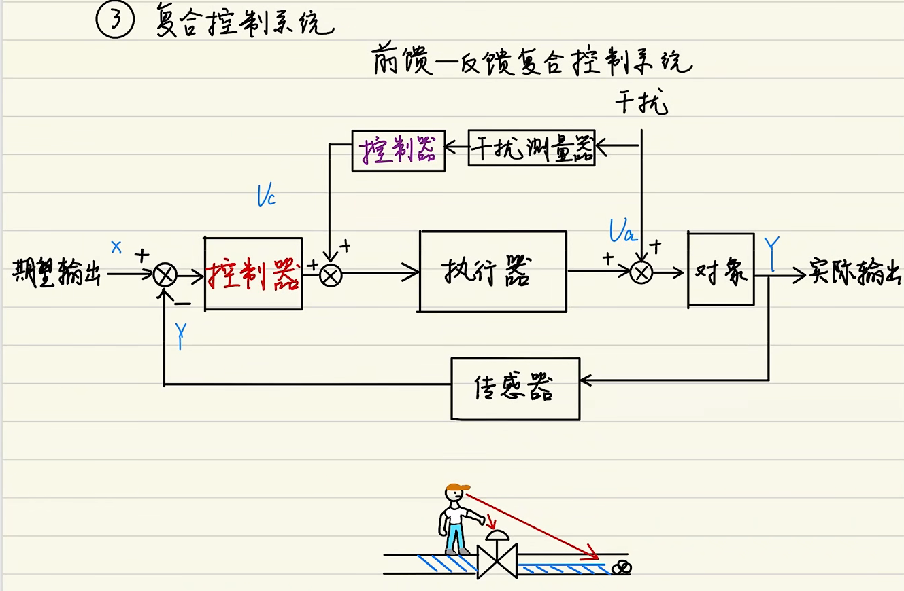
 框图解释：
 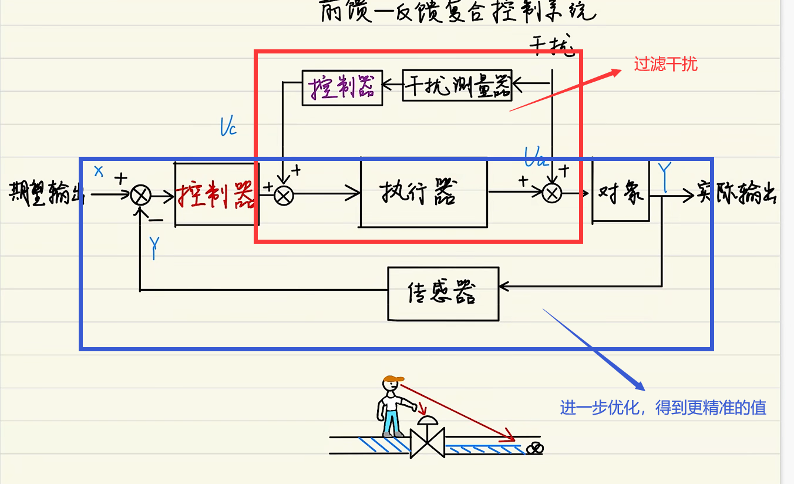
 前馈环（上方的环）作补偿即过滤干扰。反馈环根据实际的流量对系统做出反馈进行必要的补偿。

## 参数详解
### 误差
期望输出-实际输出
### 控制器输出
控制器经过对E的处理（PID运算）得到的值。
### 执行器输出
直接作用到对象的输出（对应图中就是阀门打开的大小）
### 系统输出
即为实际输出

## 连续与离散信号
1、图形表示
 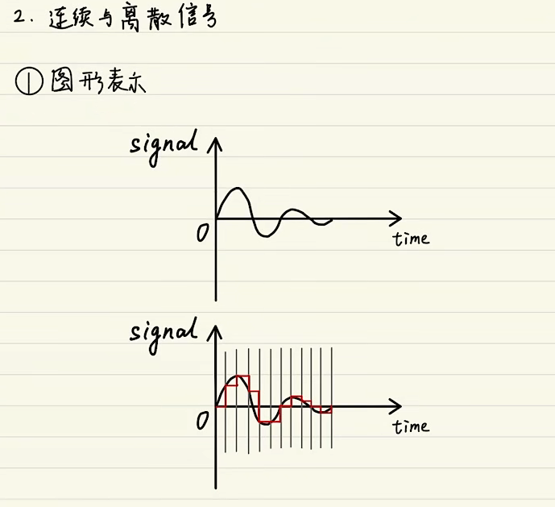 
2、数学表达式
 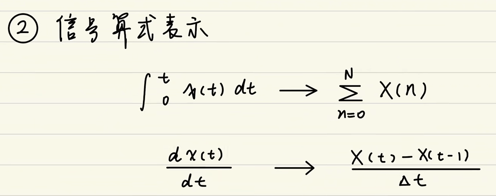 

- 积分是信号的表达式；
- 连续信号微分为离散信号表达

# PID理论学习
## PID公式
### 抽象派（教科书式）
数学公式如图所示：
 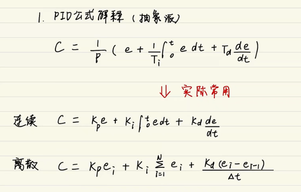 
C为输出，e为误差，P为比例度，Ti为时间积分时间，Td为微分时间。`p`/`i`/`d`为我们所需调节的参数。
 但在实际使用（计算机内使用）会归一化 
即以上**连续**PID公式和**离散**PID公式。换之为调Kp、Ki、Kd三个参数（系数）。
 离散PID公式将△t归一化得到以下公式
 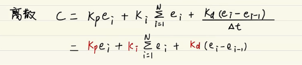 

### PID形象解释
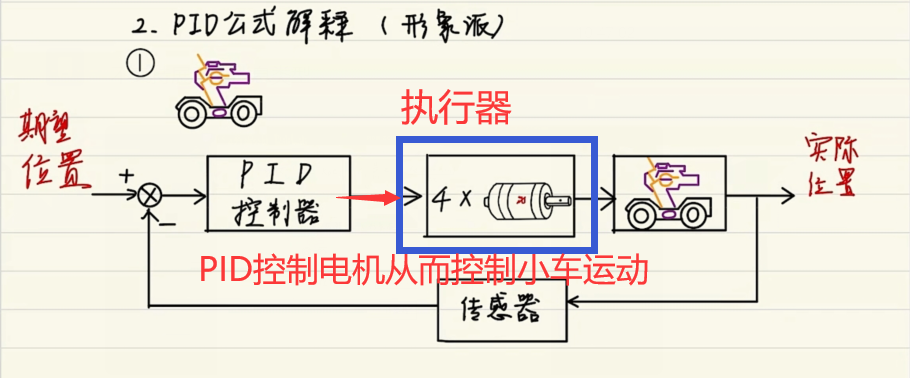
 
- P的控制作用
实例： 
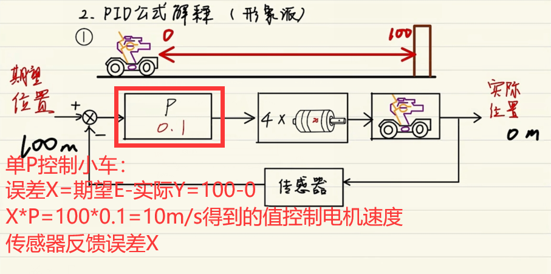
 在小车控制系统中，P主要控制小车驱动(速度)
 此时，小车距离与速度变化曲线图
 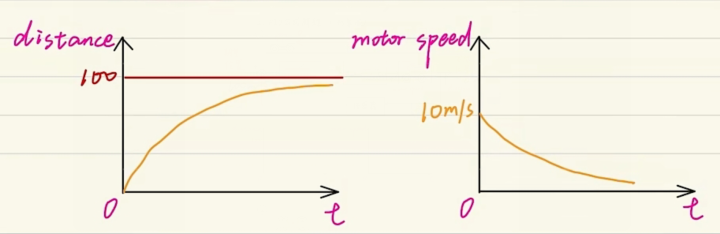
 可见，P只能无限接近期望值，不会完全等于期望值。
 P控制产生的实际值与期望值的误差称 `稳态误差`

- i的控制作用
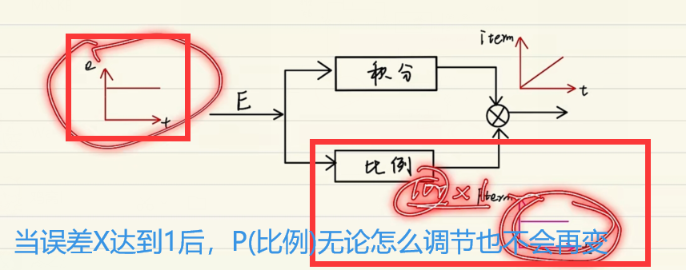
 当误差达到1时P(比例)项不会再变，因此无法达到预期值。
 i提供积分作用，使误差1无限接近0最终达到预期。
 但PI调节到误差为0时,P得到的值为0,不再提供动力。
 但I值不会因P值改变而收到影响，只会停止积累误差，可实现无人机悬停。
 示意图: 
 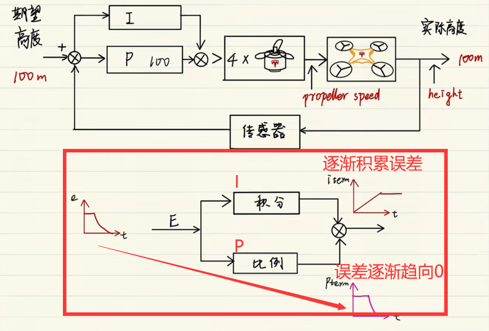

- d的控制系统
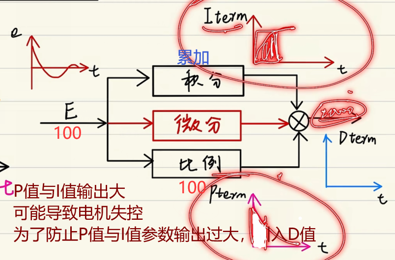
 前段区域P项与I项过大的输出可能会瞬间超过预期，为防止此情况发生引入D。
 D项给负的信号输出，防止误差小于0。
 PID综合示意图:
 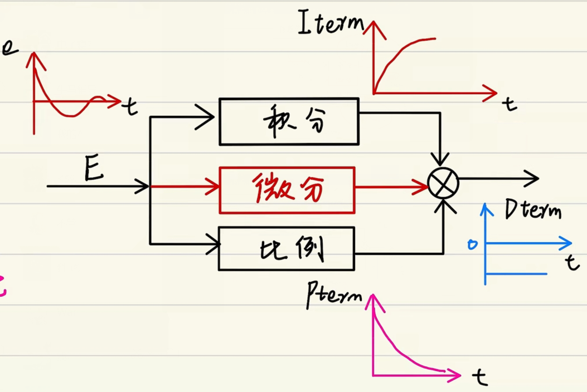

## 调参
调参示意图：
 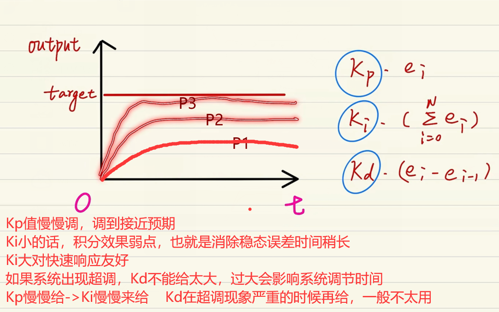

## 补充相关控制知识
### 积分限幅
先上图  
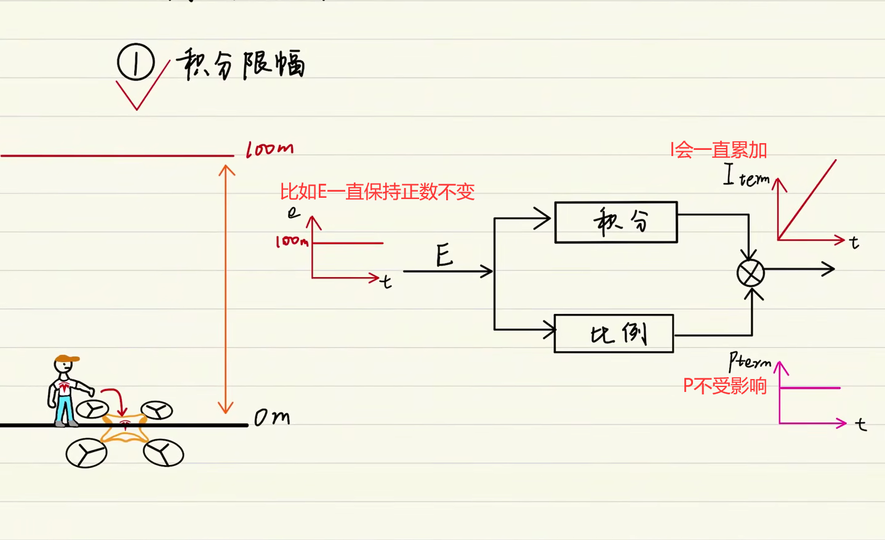  
当E不变时P不受影响，为了防止PID输出过大，需要对I进行限幅。  
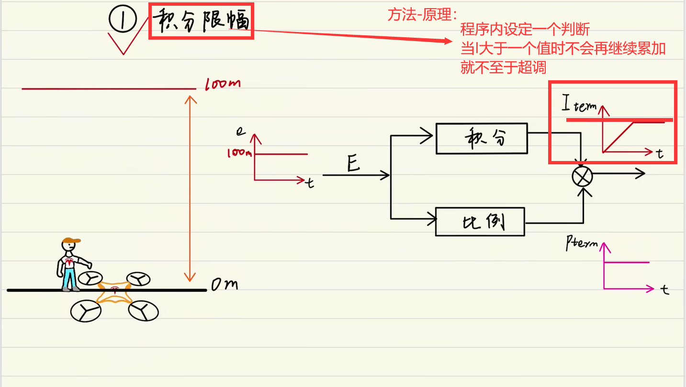  
在程序内设定一个固定值，防止I过大，以至不会超调货超调幅度不大。

### 积分分离
当目标值增大时E会增大，如果E增大的值很大的话，P与I同时作用会导致PID总输出值过大而导致系统超调  
为了防止此情况，我们需要对其进行积分分离  
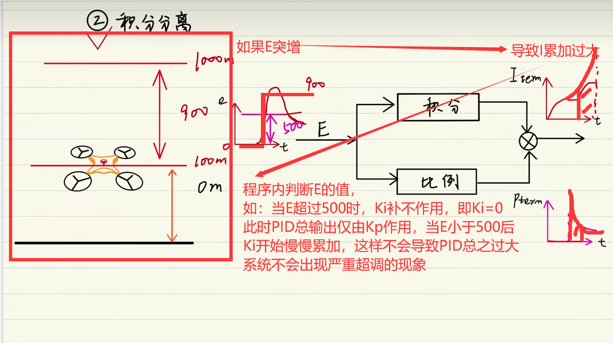  
在程序内判断E的值， 
例：当目标值突增，E大于500时，Ki影响极大，所以我们不将Ki启用，即Ki=0  
此时PID总输出仅有Kp作用，到E小于500后Ki慢慢累加，系统输出由Ki与Kp作用。  
这样可以防止系统超调。

## 实践
控制框图
 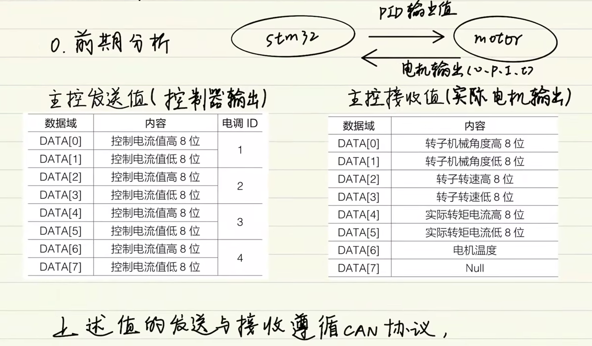  
主控发送值->PID输出值 遵循C620电调协议(CAN协议-控制器局域网络)  
:::tip
补充  
CAN总线网络主要挂在CAN_H和CAN_L，各个节点通过这两条线实现信号的串行差分传输，为了避免信号的反射和干扰，还需要在CAN_H和CAN_L之间接上120欧姆的终端电阻.
更多详解可以参照 [CAN总线协议](https://www.cnblogs.com/kmust/p/9572178.html)
:::
下图  
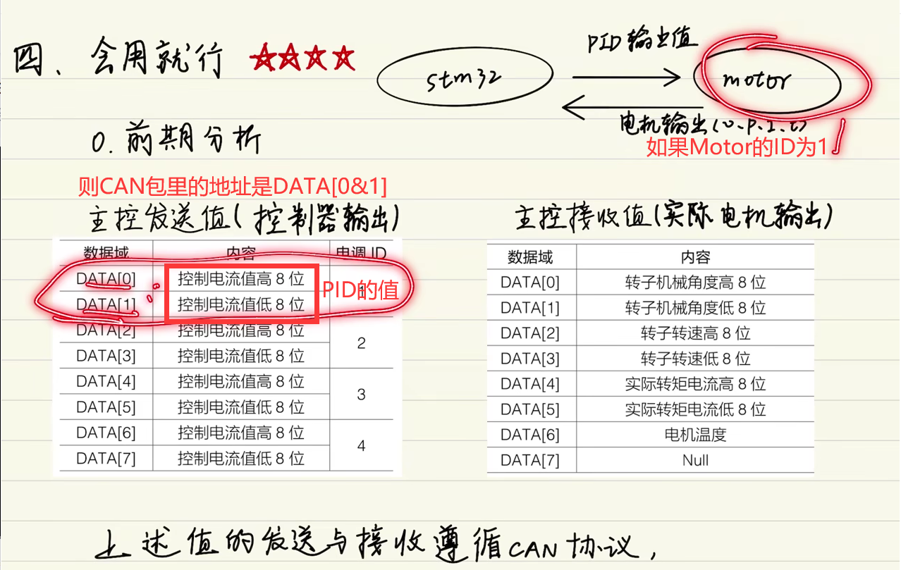
如果设Motor的ID为1，则CAN包内的0、1字节为PID的输出值  
实际控制过程如下:  
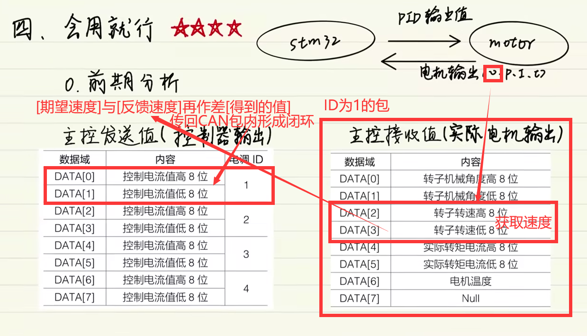  
id1的包反馈数据里面包含一些数据，通过提取其中的速度(即PID的实际输出)传回主控  
主控将期望与反馈回来的速度作差再传入CAN包DATA0与DATA1形成闭环。

### 代码实例
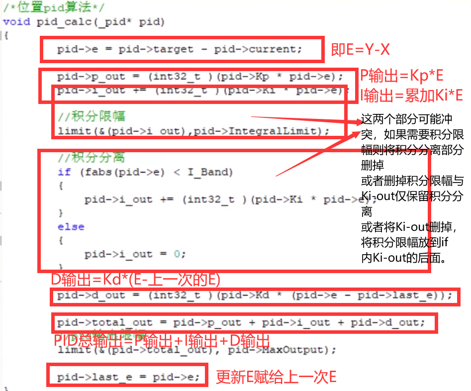  

## 结束
